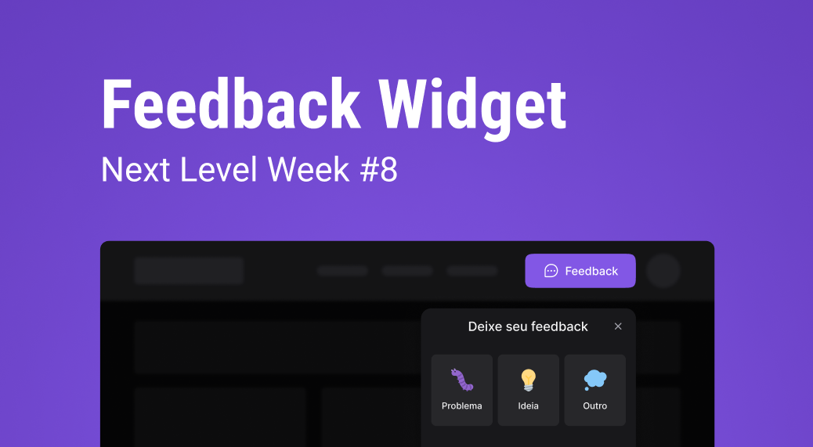

  

## 🚀 NLW Return Impulse 2022

Esse projeto foi desenvolvido durante o evento [NLW Return Impulse 2022](https://lp.rocketseat.com.br/nlw-return) da RocketSeat.
O objetivo do evento é desenvolver uma aplicação completa, desde o back-end em Node.js, front-end para web em ReactJS,
front-end mobile em React Native.

## App online para testar

App online: [feedback-widget-arianebrandao.vercel.app](https://feedback-widget-arianebrandao.vercel.app/). Front-end hospedado na [Vercel](https://vercel.com/), back-end hospedado no [Render](https://render.com) e banco de dados hospedado no [Supabase](https://supabase.com/).

## Projeto Feedback Widget

Esse é um widget que pode ser usado em qualquer app para coletar feedback (de bug, sugestão ou outros). O usuário escolhe o tipo de feedback, digita o comentário e pode clicar no botão que tira a screenshot automaticamente, então o feedback é enviado para o e-mail configurado no app e salvo no banco de dados.

## Layout

Você pode visualizar o layout do projeto através [desse link](https://www.figma.com/community/file/1102912516166573468/Feedback-Widget). É necessário ter conta no [Figma](http://figma.com/) para acessá-lo.

## Tecnologias Back-End

Esse projeto foi desenvolvido com as seguintes tecnologias no backend:

- [Node.js](https://nodejs.org)
- [TypeScript](https://www.typescriptlang.org)
- [Express](https://expressjs.com)
- [Nodemailer](https://nodemailer.com/about/)
- [Prisma](https://www.prisma.io/)
- [Mailtrap](https://mailtrap.io/)
- [Jest (para rodar testes unitários)](https://jestjs.io/)

## Tecnologias Front-End

Esse projeto foi desenvolvido com as seguintes tecnologias no frontend:

- [React](https://reactjs.org)
- [TypeScript](https://www.typescriptlang.org/)
- [Vite](https://vitejs.dev)
- [Axios](https://axios-http.com)
- [Tailwind CSS](https://tailwindcss.com/)
- [html2canvas (para tirar screenshot)](https://github.com/niklasvh/html2canvas)
- [Headless UI (para acessibilidade)](https://headlessui.dev/)
- [Phosphor Icons](https://github.com/phosphor-icons/phosphor-react)

## Como executar

- Clone o repositório
- Para iniciar o server, entre na pasta `cd server`
- Coloque seus dados do Mailtrap em `.env.example` e renomeie para `.env`
- Configure os arquivos `server/prisma/schema.prisma` e `server/prisma/migrations/migration_lock.toml` para usar o provider `sqlite`
- Instale as dependências com `npm install`
- Crie as tabelas do banco de dados com `npx prisma migrate deploy`
- Inicie o servidor com `npm run dev` (deve rodar em [`localhost:3333`](http://localhost:3333))
- Para iniciar o app, entre na pasta `cd web`
- Configure o arquivo `.env.example` e renomeie para `.env`
- Instale as dependências com `npm install`
- Inicie o app com `npm run dev` (deve rodar em [`localhost:3000`](http://localhost:3000))

## Testes
O projeto deve passar em alguns testes unitários:

- should be able to submit a feedback
- should not be able to submit a feedback without a type
- should not be able to submit a feedback without a comment
- should not be able to submit a feedback with an invalid screenshot
- should be able to createFeedbackSpy
- should be able to sendMailSpy

Para rodar os testes, use o comando `npm run test` dentro do diretório server.

## To do
- Tema light/dark
- Melhorar HTML/CSS do e-mail
- Dashboard de feedbacks
  - Autenticação (Firebase/OAuth)
- Validação de campos/erros

## Licença

Esse projeto está sob a licença MIT. Veja o arquivo [LICENSE](LICENSE.md) para mais detalhes.
